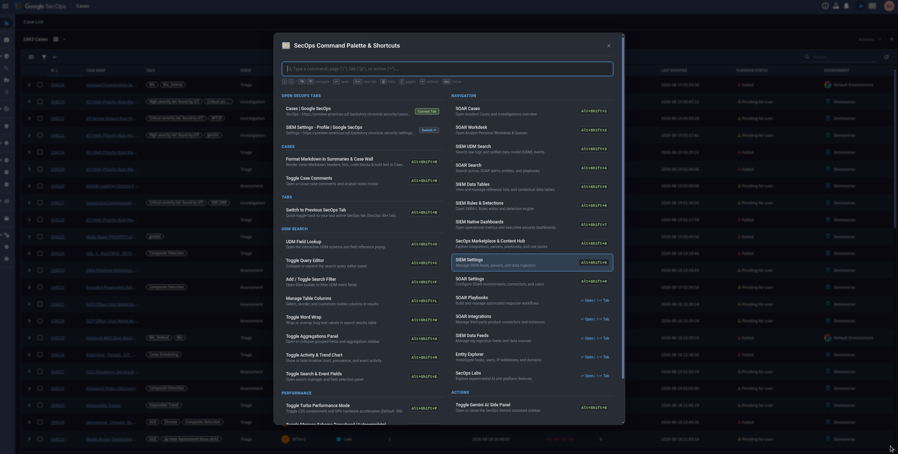

# Google SecOps Keyboard Shortcuts & Command Launcher

An unofficial Chrome Extension that provides keyboard shortcuts, an interactive Command Launcher palette, Turbo Performance rendering optimizations, Monaco editor tuning, and Markdown rendering support for Google SecOps.



> [!CAUTION]
> **Disclaimer & Word of Caution**:
> This is an **unofficial** open-source project and is **not** an officially supported Google or Google Cloud product.
> This software is provided "as is", without warranty of any kind. You use this extension at your own risk.
> Before loading or sideloading unpacked browser extensions, please verify that you are permitted to do so under your organization's internal IT, information security, and corporate software installation policies.

## Overview

This extension is designed for SecOps power users, SOC analysts, and detection engineers. It injects into Google SecOps to provide instant client-side SPA navigation, quick keyboard shortcuts, a Spotlight/Raycast-style Command Launcher, Turbo rendering performance containment, automatic Markdown rendering for Gemini Summaries and SOAR Case Wall comments, and Monaco Editor typeahead suppression for lag-free query editing.

## Features

- **Keyboard-First Command Launcher & Scope Prefixes (`Ctrl+Shift+?` / `Alt+Shift+?` / `Ctrl+K`)**:
  - **Universal Trigger**: Open anywhere instantly via <kbd>Ctrl+Shift+?</kbd>, <kbd>Alt+Shift+?</kbd>, <kbd>Cmd+Shift+?</kbd>, or <kbd>Ctrl+K</kbd> / <kbd>Cmd+K</kbd>.
  - **Clean & Compact Layout**: Turbo Mode and Monaco Typeahead status toggles are located in compact status pills in the footer, maximizing the results area for zero-scroll instant viewing.
  - **Search Prefix Scopes**:
    - `@` or `tab:` &rarr; filter strictly to open SecOps tabs across your browser windows.
    - `/` or `nav:` &rarr; filter strictly to destination pages (Cases, Workdesk, UDM Search, Rules, etc.).
    - `>` or `act:` &rarr; filter strictly to operational actions and tools (Markdown formatting, Gemini AI, UDM Lookup).
    - `#` or `case:` &rarr; filter to case-related tabs and actions.
  - **Smart Weighted Relevance**: Exact destination matches (e.g. typing `"cases"`) rank direct navigation at the top, followed by relevant open tabs, keywords, and action items.
  - **Zero-Mouse Keyboard Control**:
    - <kbd>↓</kbd> / <kbd>↑</kbd> or <kbd>Ctrl+N</kbd> / <kbd>Ctrl+P</kbd> or <kbd>Ctrl+J</kbd> / <kbd>Ctrl+K</kbd> to move selection.
    - <kbd>↵ Enter</kbd> to execute action or navigate in the current tab.
    - <kbd>⇧ Shift</kbd>+<kbd>↵ Enter</kbd> (or <kbd>Ctrl</kbd>+<kbd>↵ Enter</kbd>) to open any page or case in a **new background tab**.
    - <kbd>Alt+1</kbd> .. <kbd>Alt+9</kbd> or <kbd>Ctrl+1</kbd> .. <kbd>Ctrl+9</kbd> to jump directly to numbered commands from within the palette.
    - <kbd>Esc</kbd> to dismiss.
- **SecOps Tab Switcher & Quick Toggle (`Alt+Shift+B` / `@` / `tab:`)**:
  - **Live Tab Discovery**: Queries and displays all open Google SecOps tabs across all Chrome windows directly inside the Command Launcher.
  - **SecOps Alt+Tab (`Alt+Shift+B`)**: Instantly toggle back and forth between your two most recently active SecOps tabs without opening the launcher.
  - **Window-Aware Focus**: Switches focus to the selected tab and brings its browser window to the foreground automatically.
- **Rich Markdown Support for Case Wall & Gemini Summaries (`Alt+Shift+R`)**:
  - Automatically formats raw text comments and agent reports in the **SOAR Case Wall** (`comment-activity`, `wall-evidence-activity`, `.evidence-activity-comment`) and **Gemini Summaries**.
  - Renders **Headings** (`#`, `##`, `###`), **Bold** (`**text**`), **Italics** (`*text*`), **Inline Code** (`` `code` ``), **Fenced Code Blocks** (```` ```json...``` ````), **Bullet Lists** (`•`, `-`, `*`), and **Markdown Links** (`[title](url)`).
  - Preserves native interactive elements including `<a class="show-more__anchor">View More</a>`, entity explorer chips, and user avatars. Clicking "View More" automatically triggers re-rendering on the newly expanded text.
- **Turbo Performance Mode (`Alt+Shift+P`)**:
  - **CSS Containment**: Applies `contain: layout style` to major SecOps containers (`sc-widget-container`, `mc-widget-container`, `swc-collapsible-search-query-editor`, `sc-timeline-chart`, `#fields-aggregations`), preventing layout recalculations from cascading across 112,000+ DOM nodes.
  - **Off-Screen Rendering Pruning**: Uses `content-visibility: auto` to bypass rendering off-screen and collapsed panels until needed.
  - **GPU Layer Acceleration**: Promotes table rows and data cells to isolated GPU compositor layers (`transform: translateZ(0)`), delivering smooth table scrolling.
  - **Defaults to ON**: Automatically active on page load with persistent toggle control.
- **Monaco Typeahead Performance Tuning (`Alt+Shift+T`)**:
  - **Lag-Free Typing**: Suppresses automatic popup typeahead across the massive UDM schema hierarchy, eliminating typing latency and UI stutters in UDM Search and YARA-L Rule Editor.
  - **Defaults to OFF (High Performance)**: Automatically applies high-performance options to current and newly created Monaco editor instances via MAIN-world bridge (`monaco_bridge.js`).
  - **On-Demand Autocomplete**: You can still trigger autocomplete manually at any time by pressing <kbd>Ctrl</kbd>+<kbd>Space</kbd>.
- **Command Palette & Launcher (`Ctrl+Shift+?` / `Alt+Shift+?` / `Ctrl+K`)**:
  - Search any SecOps destination (Cases, Rules, Playbooks, Dashboards, Feeds, Integrations, etc.) or action (Turbo Mode, Typeahead, Word Wrap, Markdown Repair, Gemini Side Panel, UDM Lookup, Columns, etc.).
  - **Interactive Click & Keyboard Navigation**: Use <kbd>↓</kbd> / <kbd>↑</kbd> to move selection and <kbd>Enter</kbd> to execute, or click any row directly.
  - **Instant Client-Side SPA Transitions**: Switches routes in milliseconds without hard page reloads.
- **Direct Keyboard Shortcuts**: Rich set of chorded `Alt+Shift+<Key>` and `Ctrl+Shift+<Key>` combinations.
- **Adaptive Dark & Light Theme**: Seamlessly adapts to Google SecOps's native light and dark modes via CSS custom properties.
- **Header Integration**: Adds a shortcut launcher button directly in the main SecOps navigation header.

## How to Use

1. Press `Ctrl+Shift+?`, `Alt+Shift+?`, or `Ctrl+K` (or click the shortcuts icon in the header) to open the **Command Palette**.
2. Press `Alt+Shift+B` to quick-switch back to your previous SecOps tab (SecOps `Alt+Tab`).
3. In the Command Palette, type `@` (or `tab:`) or any case/page title to view and jump between open SecOps tabs.
4. Toggle **Turbo Performance Mode** (`Alt+Shift+P`) or **Monaco Typeahead** (`Alt+Shift+T`) directly from the footer status pills or via shortcuts.
5. Press `Alt+Shift+R` anytime to re-format Markdown in Case Wall comments or Gemini summaries.
6. Press <kbd>↵ Enter</kbd> to execute/navigate, or <kbd>⇧ Shift</kbd>+<kbd>↵ Enter</kbd> to open in a new tab.

## Available Shortcuts & Commands

### Tab Management & Switching

| Shortcut | Action | Description |
| :--- | :--- | :--- |
| `Alt+Shift+B` | **Switch to Previous SecOps Tab** | Quick-toggle back to your last active SecOps tab (SecOps `Alt+Tab`) |
| *Launcher* / `tab:` | **Open SecOps Tabs List** | List all open SecOps tabs with badges and jump to any tab instantly |
| *Launcher* | **Open Cases in New Tab** | Open Incident Cases in a new background browser tab |
| *Launcher* | **Open UDM Search in New Tab** | Open SIEM UDM Search in a new background browser tab |

### Case, Comments & AI Actions

| Shortcut | Action | Description |
| :--- | :--- | :--- |
| `Alt+Shift+R` | **Format Markdown in Summaries & Case Wall** | Render clean Markdown headers, lists, code blocks & bold text in Case Wall & Gemini summaries |
| `Alt+Shift+G` | **Toggle Gemini AI Side Panel** | Open or close the SecOps Gemini assistant sidebar |
| `Alt+Shift+N` | **Toggle Case Comments** | Open or close case comments and analyst notes |

### Performance & Tuning

| Shortcut | Action | Description |
| :--- | :--- | :--- |
| `Alt+Shift+P` | **Toggle Turbo Performance Mode** | Toggle CSS layout containment and GPU hardware acceleration (Defaults to ON) |
| `Alt+Shift+T` | **Toggle Monaco Typeahead** | Toggle popup autocomplete in UDM Search and YARA-L Rule Editor (Defaults to OFF) |

### Navigation

| Shortcut | Destination | Description |
| :--- | :--- | :--- |
| `Alt+Shift+1` | **SOAR Cases** | Open Incident Cases and Investigations overview |
| `Alt+Shift+2` | **SOAR Workdesk** | Open Analyst Personal Workdesk & Queues |
| `Alt+Shift+3` | **SIEM UDM Search** | Search raw logs and unified data model (UDM) events |
| `Alt+Shift+4` | **SOAR Search** | Search across SOAR alerts, entities, and playbooks |
| `Alt+Shift+5` | **SIEM Data Tables** | View and manage reference lists and contextual data tables |
| `Alt+Shift+6` | **SIEM Rules & Detections** | Open YARA-L Rules editor and detection engine |
| `Alt+Shift+7` | **SIEM Native Dashboards** | Open operational metrics and executive security dashboards |
| `Alt+Shift+8` | **Content Hub & Marketplace** | Explore integrations, parsers, playbooks, and rule packs |
| `Alt+Shift+9` | **SIEM Settings** | Manage SIEM feeds, parsers, and data ingestion |
| `Alt+Shift+0` | **SOAR Settings** | Configure SOAR environments, connectors, and users |
| *Launcher* | **SOAR Playbooks** | Build and manage automated response workflows |
| *Launcher* | **SOAR Integrations** | Manage third-party product connectors and instances |
| *Launcher* | **SIEM Data Feeds** | Manage log ingestion feeds and data sources |
| *Launcher* | **Entity Explorer** | Investigate hosts, users, IP addresses, and domains |
| *Launcher* | **SecOps Labs** | Explore experimental AI and platform features |

### UDM Search Actions

| Shortcut | Action | Description |
| :--- | :--- | :--- |
| `Alt+Shift+U` | **UDM Field Lookup** | Open interactive UDM schema and field reference popup |
| `Alt+Shift+C` | **Toggle Query Editor** | Collapse or expand the search query editor panel |
| `Alt+Shift+F` | **Add / Toggle Filter** | Open filter builder to filter UDM event fields |
| `Alt+Shift+L` | **Manage Table Columns** | Select, reorder, and customize visible columns |
| `Alt+Shift+W` | **Toggle Word Wrap** | Wrap or unwrap long text values in search results table |
| `Alt+Shift+A` | **Toggle Aggregations Panel** | Open or collapse grouped fields and aggregation sidebar |
| `Alt+Shift+M` | **Toggle Activity & Trend Chart** | Show or hide timeline chart, prevalence, and event activity |
| `Alt+Shift+E` | **Toggle Search & Event Fields** | Open search manager and field selection panel |

## Installation

1. Open Google Chrome and navigate to `chrome://extensions`.
2. Enable **Developer mode** (toggle in top-right corner).
3. Click **Load unpacked** and select the `secops_chrome_keyboard_extensions` directory.
4. Reload your Google SecOps tab to start using the extension.

